# ✨ Sample of escaping

Show how to put codeblocks in the prompt _(which is already in the codeblock)_

-   PIPELINE URL https://promptbook.studio/samples/escaping.ptbk.md
-   PROMPTBOOK VERSION 1.0.0
-   OUTPUT PARAMETER `{greeting1}`
-   OUTPUT PARAMETER `{greeting2}`

```mermaid
%% 🔮 Tip: Open this on GitHub or in the VSCode website to see the Mermaid graph visually

flowchart LR
  subgraph "✨ Sample of escaping"

      direction TB

      input((Input)):::input
      templatePrompt("💬 Prompt")

      templatePrompt--"{greeting}"-->output
      output((Output)):::output

      click templatePrompt href "#prompt" "💬 Prompt";

      classDef input color: grey;
      classDef output color: grey;

  end;
```

<!--Graph-->
<!-- ⚠️ WARNING: This code has been generated so that any manual changes will be overwritten -->



<!--/Graph-->

## Greeting 1

Show how to put codeblocks in codeblocks

```
Rewrite the function below:

\`\`\`javascript
function greet() {
  return 'Hello Anna';
}
\`\`\`

To return "Goodbye" from the function instead of "Hello".

```

`-> {greeting1}`

## Greeting 2

Show how to put codeblocks in codeblocks in different way

> Rewrite the function below:
>
> ```javascript
> function greet() {
>     return 'Hello Betty';
> }
> ```
>
> To return "Goodbye" from the function instead of "Hello".

`-> {greeting2}`
