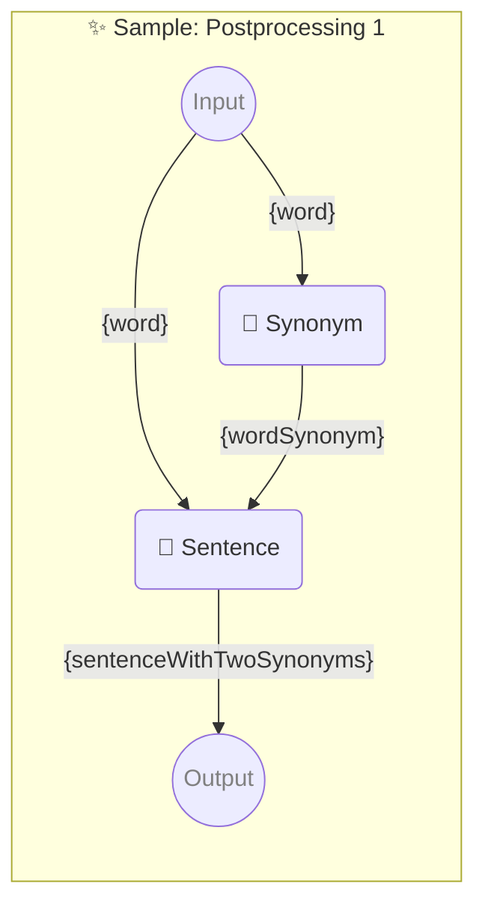

# ✨ Sample: Postprocessing 1

Show how to use two consecutive prompts with one parameter each.

-   PIPELINE URL https://promptbook.example.com/samples/postprocessing-1.ptbk.md
-   PROMPTBOOK VERSION 1.0.0
-   MODEL VARIANT Chat
-   MODEL NAME `gpt-3.5-turbo`
-   INPUT  PARAMETER `{word}` Any single word
-   OUTPUT PARAMETER `{sentenceWithTwoSynonyms}`

<!--Graph-->
<!-- ⚠️ WARNING: This section was auto-generated -->



<!--/Graph-->

## 💬 Synonym

Synonym for word

-   POSTPROCESSING `unwrapResult`

```text
Write synonym for "{word}"
```

`-> {wordSynonym}`

## 💬 Sentence

Sentence with word and wordSynonym

-   POSTPROCESSING `unwrapResult`
-   POSTPROCESSING `spaceTrim`

```text
Write sentence with "{word}" and "{wordSynonym}" in it
```

`-> {sentenceWithTwoSynonyms}`
