# ✨ Sample: Postprocessing 1

Show how to use two consecutive prompts with one parameter each.

-   PROMPTBOOK URL https://promptbook.example.com/samples/postprocessing-1.ptbk.md@v1
-   PROMPTBOOK VERSION 1.0.0
-   INPUT  PARAMETER `{word}` Any single word

```mermaid
%% 🔮 Tip: Open this on GitHub or in the VSCode website to see the Mermaid graph visually

flowchart LR
  subgraph "✨ Sample: Postprocessing 1"

      direction TB

      input((Input)):::input
      templateSynonym(💬 Synonym)
      input--"{word}"-->templateSynonym
      templateSentence(💬 Sentence)
      input--"{word}"-->templateSentence
      templateSynonym--"{wordSynonym}"-->templateSentence

      classDef input color: grey;

  end;
```

<!--Graph-->
<!-- ⚠️ WARNING: This section was auto-generated -->



<!--/Graph-->

## 💬 Synonym

Synonym for word

-   POSTPROCESSING `unwrapResult`

```text
Write synonym for "{word}"
```

`-> {wordSynonym}`

## 💬 Sentence

Sentence with word and wordSynonym

-   POSTPROCESSING `unwrapResult`
-   POSTPROCESSING `spaceTrim`

```text
Write sentence with "{word}" and "{wordSynonym}" in it
```

`-> {sentenceWithTwoSynonyms}`
