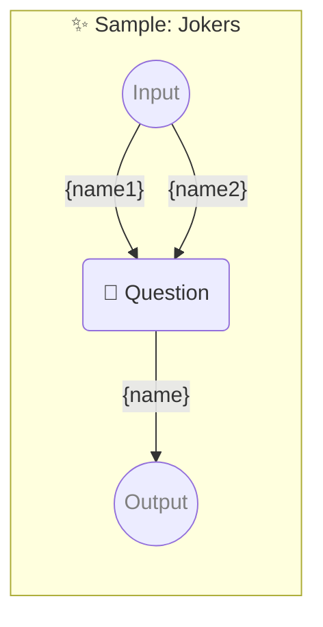

# ✨ Sample: Jokers

-   PROMPTBOOK URL https://promptbook.example.com/samples/jokers.ptbk.md@v1
-   PROMPTBOOK VERSION 1.0.0
-   MODEL VARIANT Chat
-   MODEL NAME `gpt-3.5-turbo`
-   INPUT  PARAMETER {name1} First name or nothing
-   INPUT  PARAMETER {name2} Second name or nothing
-   OUTPUT PARAMETER `{name}`

<!--Graph-->
<!-- ⚠️ WARNING: This section was auto-generated -->



<!--/Graph-->

## 💬 Question

-   JOKER {name1}
-   JOKER {name2}
-   EXPECT MIN 2 WORDS

```markdown
Write some name for hero
```

-> {name}
