# ✨ Sample: Jokers

-   PIPELINE URL https://promptbook.studio/samples/jokers.ptbk.md
-   PROMPTBOOK VERSION 1.0.0
-   INPUT  PARAMETER {name1} First name or nothing
-   INPUT  PARAMETER {name2} Second name or nothing
-   OUTPUT PARAMETER `{name}`

```mermaid
%% 🔮 Tip: Open this on GitHub or in the VSCode website to see the Mermaid graph visually

flowchart LR
  subgraph "✨ Sample: Jokers"

      direction TB

      input((Input)):::input
      templateQuestion("💬 Question")
      input--"{name1}"-->templateQuestion
      input--"{name2}"-->templateQuestion

      templateQuestion--"{name}"-->output
      output((Output)):::output

      click templateQuestion href "#question" "💬 Question";

      classDef input color: grey;
      classDef output color: grey;

  end;
```

<!--Graph-->
<!-- ⚠️ WARNING: This code has been generated so that any manual changes will be overwritten -->



<!--/Graph-->

## 💬 Question

-   JOKER {name1}
-   JOKER {name2}
-   EXPECT MIN 2 WORDS

```markdown
Write some name for hero
```

`-> {name}`
