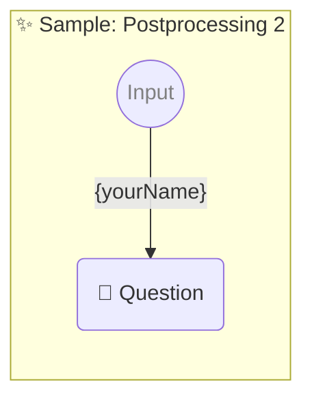

# ✨ Sample: Postprocessing 2

-   PROMPTBOOK URL https://promptbook.example.com/samples/postprocessing-2.ptbk.md@v1
-   PROMPTBOOK VERSION 1.0.0
-   INPUT  PARAMETER {yourName} Name of the hero

<!--Graph-->
<!-- ⚠️ WARNING: This section was auto-generated -->



<!--/Graph-->

## 💬 Question

-   POSTPROCESSING reverse
-   POSTPROCESSING removeDiacritics
-   POSTPROCESSING normalizeTo_SCREAMING_CASE

```markdown
Hello {yourName}!
```

-> {greeting}
