# ✨ Sample: Postprocessing 2

-   PTBK URL https://ptbk.example.com/samples/postprocessing-2.ptbk.md@v1
-   PTBK VERSION 1.0.0
-   INPUT  PARAMETER {yourName} Name of the hero

```mermaid
%% 🔮 Tip: Open this on GitHub or in the VSCode website to see the Mermaid graph visually

flowchart LR
    subgraph "✨ Sample: Postprocessing 2"

        direction TB

        input[Input]


        templateQuestion[💬 Question]
        input--"{yourName}"-->templateQuestion





    end
```

<!--Graph-->
<!-- ⚠️ WARNING: This section was auto-generated -->

<!--/Graph-->

## 💬 Question

-   POSTPROCESSING reverse
-   POSTPROCESSING removeDiacritics
-   POSTPROCESSING normalizeTo_SCREAMING_CASE

```markdown
Hello {yourName}!
```

-> {greeting}
