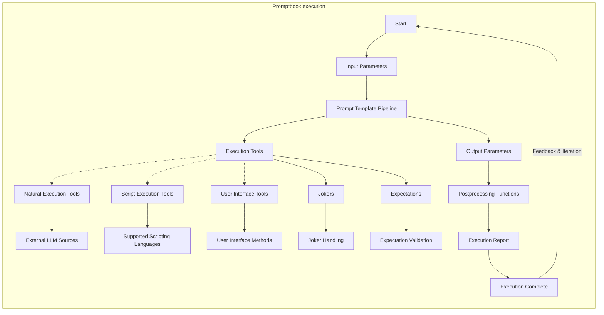

# ✨ Sample: Parsing data to JSON

-   PTBK URL https://ptbk.example.com/samples/postprocessing-2.ptbk.md@v1
-   PTBK VERSION 1.0.0
-   INPUT  PARAMETER {sentence} Sentence to be processed

<!--Graph-->
<!-- ⚠️ WARNING: This section was auto-generated -->

<!--/Graph-->

## 💬 Question

-   MODEL VARIANT COMPLETION
-   MODEL NAME `gpt-3.5-turbo-instruct`
-   POSTPROCESSING `trimEndOfCodeBlock`
-   Expect JSON

```
Dark horse hopping over the fence.

\`\`\`json
{
  "subject": "horse",
  "action": "hopping",
  "object": "fence"
}
\`\`\`

---

{sentence}

\`\`\`json
```

-> {parsedSentence}
