# ✨ Sample: Expectations

-   PROMPTBOOK URL https://promptbook.example.com/samples/postprocessing-2.ptbk.md@v1
-   PROMPTBOOK VERSION 1.0.0
-   INPUT  PARAMETER {yourName} Name of the hero
-   OUTPUT PARAMETER `{greeting}`

```mermaid
%% 🔮 Tip: Open this on GitHub or in the VSCode website to see the Mermaid graph visually

flowchart LR
  subgraph "✨ Sample: Expectations"

      direction TB

      input((Input)):::input
      templateQuestion("💬 Question")
      input--"{yourName}"-->templateQuestion

      templateQuestion--"{greeting}"-->output
      output((Output)):::output

      click templateQuestion href "#question";

      classDef input color: grey;
      classDef output color: grey;

  end;
```

<!--Graph-->
<!-- ⚠️ WARNING: This section was auto-generated -->



<!--/Graph-->

## 💬 Question

-   MODEL VARIANT Chat
-   MODEL NAME `gpt-3.5-turbo`
-   EXPECT MAX 30 CHARACTERS
-   EXPECT MIN 2 CHARACTERS
-   EXPECT MAX 3 WORDS
-   EXPECT EXACTLY 1 SENTENCE
-   EXPECT EXACTLY 1 LINE

```markdown
Hello {yourName}!
```

-> {greeting}
