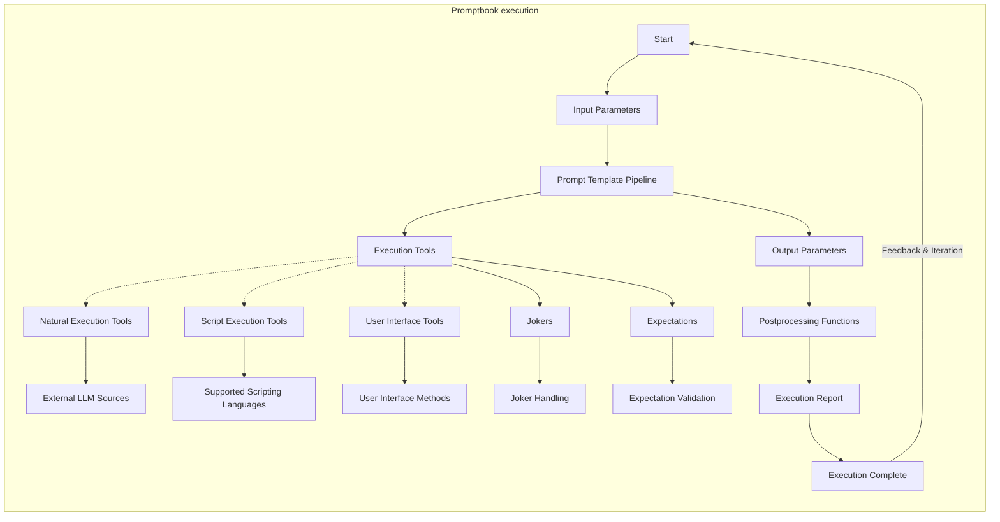

# ✨ Sample: Language Capabilities

Trying the language capabilities of GPT models.

-   PTBK URL https://ptbk.example.com/samples/language-capabilities.ptbk.md@v1
-   PTBK VERSION 1.0.0
-   MODEL VARIANT CHAT
-   MODEL NAME `gpt-3.5-turbo`
-   Input  parameter `{word}` The word to use in the prompt.
-   OUTPUT PARAMETER `{comparisonOfTwoSentences}` Comparison between two sentences
-   OUTPUT PARAMETER `{summary}` The overall summary of the comparison

<!--Graph-->
<!-- ⚠️ WARNING: This section was auto-generated -->

<!--/Graph-->

## 💬 Synonym

Synonym for word

-   MODEL VARIANT CHAT
-   MODEL NAME `gpt-3.5-turbo`
-   POSTPROCESSING `unwrapResult`
-   EXPECT EXACTLY 1 WORD

```text
Write synonym for "{word}"
```

`-> {wordSynonym}`

## ⚙ Test that word is not original word

-   EXECUTE SCRIPT

```javascript
if (word !== '' && wordSynonym === word) {
    throw new Error(`Synonym returned from LLM is same as original word "${word}"`);
}

return wordSynonym;
```

`-> {wordSynonymTested}`

## 💬 Sentence with Synonym

Sentence with word and wordSynonym

-   MODEL VARIANT CHAT
-   MODEL NAME `gpt-3.5-turbo`
-   EXPECT MAX 20 WORDS
-   EXPECT EXACTLY 1 SENTENCE

```text
Write sentence with "{word}" and "{wordSynonym}" in it
```

`-> {sentenceWithTwoSynonyms}` Sentence with word and wordSynonym

## 💬 Sentence without original word

Sentence "{sentenceWithTwoSynonyms}" without "{word}".

-   MODEL VARIANT CHAT
-   MODEL NAME `gpt-3.5-turbo`
-   EXPECT MAX 20 WORDS
-   EXPECT EXACTLY 1 SENTENCE

```markdown
Remove word "{word}" from sentence and modify it so that it makes sense:

## Rules:

-   Sentence must be grammatically correct
-   Sentence must make sense after removing the word

## The Sentence:

> {sentenceWithTwoSynonyms}
```

`-> {sentenceWithOriginalWordRemoved}` Sentence with both synomyms but without a original word

## 💬 Comparison

Comparison between "{sentenceWithTwoSynonyms}" and "{sentenceWithOriginalWordRemoved}".

-   MODEL VARIANT CHAT
-   MODEL NAME `gpt-4`
-   EXPECT MIN 1 SENTENCE
-   EXPECT MAX 5 SENTENCES

```markdown
Compare meaning of thee two sentences:

## Sentence 1:

> {sentenceWithTwoSynonyms}

## Sentence 2:

> {sentenceWithOriginalWordRemoved}
```

`-> {comparisonOfTwoSentences}` Comparison between two sentences

## 🔗 Summary

-   SIMPLE TEMPLATE

```markdown
You have entered a word **{word}**. For this word the best synonym is **{wordSynonym}**. The sentence with both words is **{sentenceWithTwoSynonyms}**. The sentence without the original word is **{sentenceWithOriginalWordRemoved}**. And the comparison between the two sentences is:

> {comparisonOfTwoSentences}
```

`-> {summary}`
