# ✨ Sample: Nesting

How block are nested in the promptbook

-   PIPELINE URL https://promptbook.studio/samples/nesting.ptbk.md
-   PROMPTBOOK VERSION 1.0.0
-   INPUT  PARAMETER `{word}` The word to use in the prompt.
-   OUTPUT PARAMETER `{poem}`

```mermaid
%% 🔮 Tip: Open this on GitHub or in the VSCode website to see the Mermaid graph visually

flowchart LR
  subgraph "✨ Sample: Nesting"

      direction TB

      input((Input)):::input
      templateSynonym("💬 Synonym")
      input--"{word}"-->templateSynonym
      templateSentence("💬 Sentence")
      input--"{word}"-->templateSentence
      templateSynonym--"{wordSynonym}"-->templateSentence
      templateMakeADocument("Make a document")
      templateSentence--"{sentence}"-->templateMakeADocument

      templateMakeADocument--"{poem}"-->output
      output((Output)):::output

      click templateSynonym href "#synonym" "💬 Synonym";
      click templateSentence href "#sentence" "💬 Sentence";
      click templateMakeADocument href "#make-a-document" "Make a document";

      classDef input color: grey;
      classDef output color: grey;

  end;
```

<!--Graph-->
<!-- ⚠️ WARNING: This section was auto-generated -->



<!--/Graph-->

## 💬 Synonym

Synonym for word

-   MODEL VARIANT Chat
-   MODEL NAME `gpt-3.5-turbo`
-   POSTPROCESSING `unwrapResult`
-   EXPECT EXACTLY 1 WORD

```text
Write synonym for "{word}"
```

`-> {wordSynonym}`

## 💬 Sentence

Sentence with the both words

-   MODEL VARIANT Chat
-   MODEL NAME `gpt-3.5-turbo`
-   POSTPROCESSING `unwrapResult`
-   EXPECT MIN 1 SENTENCE

```text
Write sentence with "{word}" and "{wordSynonym}"
```

`-> {sentence}`

## Make a document

-   MODEL VARIANT Chat
-   MODEL NAME `gpt-3.5-turbo`
-   POSTPROCESSING `unwrapResult`

```markdown
Write poem with starting sentence:

\`\`\`text
{sentence}
\`\`\`
```

`-> {poem}`
