# ✨ Sample: Nesting

How block are nested in the promptbook

-   PTBK URL https://ptbk.example.com/samples/language-capabilities.ptbk.md@v1
-   PTBK VERSION 1.0.0
-   MODEL VARIANT CHAT
-   MODEL NAME `gpt-3.5-turbo`
-   Input  parameter `{word}` The word to use in the prompt.
-   OUTPUT PARAMETER `{comparisonOfTwoSentences}` Comparison between two sentences
-   OUTPUT PARAMETER `{summary}` The overall summary of the comparison

```mermaid
%% 🔮 Tip: Open this on GitHub or in the VSCode website to see the Mermaid graph visually

flowchart LR
    subgraph "✨ Sample: Nesting"

        direction TB

        input[Input]


        templateSynonym[💬 Synonym]
        input--"{word}"-->templateSynonym
        templateSentence[💬 Sentence]
        input--"{word}"-->templateSentence
        templateSynonym--"{wordSynonym}"-->templateSentence
        templateMakeADocument[Make a document]
        templateSentence--"{sentence}"-->templateMakeADocument





    end
```

<!--Graph-->
<!-- ⚠️ WARNING: This section was auto-generated -->

<!--/Graph-->

## 💬 Synonym

Synonym for word

-   MODEL VARIANT CHAT
-   MODEL NAME `gpt-3.5-turbo`
-   POSTPROCESSING `unwrapResult`
-   EXPECT EXACTLY 1 WORD

```text
Write synonym for "{word}"
```

`-> {wordSynonym}`

## 💬 Sentence

Sentence with the both words

-   MODEL VARIANT CHAT
-   MODEL NAME `gpt-3.5-turbo`
-   POSTPROCESSING `unwrapResult`
-   EXPECT MIN 1 SENTENCE

```text
Write sentence with "{word}" and "{wordSynonym}"
```

`-> {sentence}`

## Make a document

-   MODEL VARIANT CHAT
-   MODEL NAME `gpt-3.5-turbo`
-   POSTPROCESSING `unwrapResult`

```markdown
Write poem with starting sentence:

\`\`\`text
{sentence}
\`\`\`
```

`-> {poem}`
