# ✨ Sample: JSON mode

Trying the language capabilities of GPT models.

-   PTBK URL https://ptbk.example.com/samples/json-mode.ptbk.md@v1
-   PTBK VERSION 1.0.0
-   MODEL VARIANT CHAT
-   INPUT  PARAM `{unstructuredContacts}` nestrukturovaný seznam kontaktních údajů
-   OUTPUT PARAM `{contactlist}` JSON seznam kontaktních údajů

```mermaid
%% 🔮 Tip: Open this on GitHub or in the VSCode website to see the Mermaid graph visually

flowchart LR
  subgraph "✨ Sample: JSON mode"

      direction TB

      input[<!--Input-->]:::hidden
      templateExtrakceKontaktnChDaj[🖋 Extrakce kontaktních údajů]
      input--"{unstructuredContacts}"-->templateExtrakceKontaktnChDaj

      classDef hidden visibility: hidden;

  end;
```

<!--Graph-->
<!-- ⚠️ WARNING: This section was auto-generated -->

<!--/Graph-->

## 🖋 Extrakce kontaktních údajů

-   MODEL VARIANT COMPLETION
-   MODEL NAME `gpt-3.5-turbo-instruct`
-   POSTPROCESSING `trimEndOfCodeBlock`

<!-- TODO: !!! Use here JSON mode-->

```
Extrahuj kontaktní data z nestrukturovaného seznamu kontaktních údajů

## 1. Nestrukturované údaje

\`\`\`text
info@webgpt.cz
https://www.facebook.com/webgptorg
https://www.instagram.com/webgpt.cz/
https://www.linkedin.com/company/98725909/

AI Web s.r.o.
IČO: 21012288
Datová schránka: hzuu4yn

Pavol Hejný
Vývojář
pavol@webgpt.cz
+420774080996

Jiří Jahn
Marketing, Obchod
jirka@webgpt.cz

Ainautes
Skupina lidí za projektem
https://ainautes.com
\`\`\`

## 1. Strukturované údaje

\`\`\`json
[
  {
    "role": "OWNER",
    "fullname": "AI Web s.r.o.",
    "share": 1
  },
  {
    "role": "TECHNICAL",
    "fullname": "Pavol Hejný",
    "email": "pavol@webgpt.cz",
    "phone": "+420420774080996"
  },
  {
    "role": "LEGAL",
    "fullname": "Jiří Jahn",
    "email": "jirka@webgpt.cz"
  },
  {
    "role": "CONTENT_MANAGER",
    "fullname": "Jiří Jahn",
    "email": "jirka@webgpt.cz"
  },
  {
    "role": "OTHER",
    "roleDescription": "Skupina lidí za projektem",
    "fullname": "Ainautes",
    "web": "https://ainautes.com"
  }
]
\`\`\`

## 2. Nestrukturované údaje

\`\`\`text
{unstructuredContacts}
\`\`\`

## 2. Strukturované údaje

\`\`\`json
```

`-> {contactlist}`
