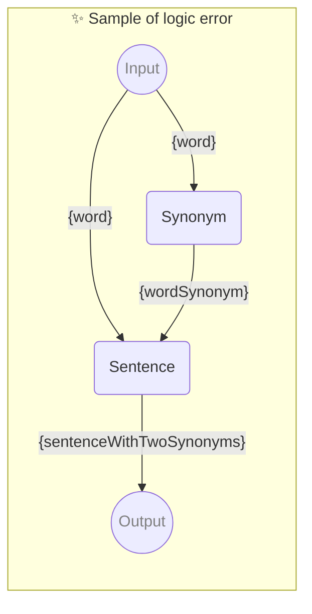

# ✨ Sample of logic error

Sample of using parameter in reverse order

_Note: This is not recommended but it should work_

-   PROMPTBOOK URL https://promptbook.example.com/samples/parameter-used-in-reverse-order.ptbk.md@v1
-   PROMPTBOOK VERSION 1.0.0
-   MODEL VARIANT Chat
-   MODEL NAME `gpt-3.5-turbo`
-   INPUT  PARAMETER `{word}` Any single word
-   OUTPUT PARAMETER `{sentenceWithTwoSynonyms}`

<!--Graph-->
<!-- ⚠️ WARNING: This section was auto-generated -->



<!--/Graph-->

## Sentence

Sentence with word and wordSynonym

```text
Write sentence with "{word}" and "{wordSynonym}" in it
```

`-> {sentenceWithTwoSynonyms}`

## Synonym

Synonym for word

```text
Write synonym for "{word}"
```

`-> {wordSynonym}`
