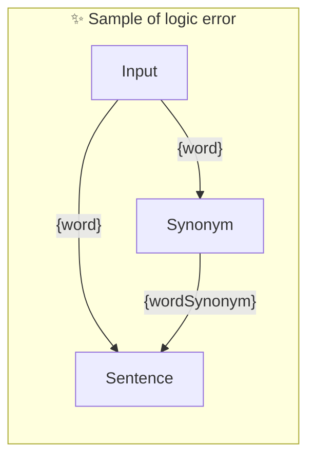

# ✨ Sample of logic error

Sample of using parameter in reverse order

_Note: This is not recommended but it should work_

-   PTBK URL https://ptbk.example.com/samples/parameter-used-in-reverse-order.ptbk.md@v1
-   PTBK VERSION 1.0.0
-   INPUT  PARAMETER `{word}` Any single word

<!--Graph-->
<!-- ⚠️ WARNING: This section was auto-generated -->

<!--/Graph-->

## Sentence

Sentence with word and wordSynonym

```text
Write sentence with "{word}" and "{wordSynonym}" in it
```

`-> {sentenceWithTwoSynonyms}`

## Synonym

Synonym for word

```text
Write synonym for "{word}"
```

`-> {wordSynonym}`
