# ✨ Sample of logic error

Sample of using parameter in reverse order

_Note: This is not recommended but it should work_

-   PROMPTBOOK URL https://promptbook.example.com/samples/parameter-used-in-reverse-order.ptbk.md@v1
-   PROMPTBOOK VERSION 1.0.0
-   INPUT  PARAMETER `{word}` Any single word

```mermaid
%% 🔮 Tip: Open this on GitHub or in the VSCode website to see the Mermaid graph visually

flowchart LR
  subgraph "✨ Sample of logic error"

      direction TB

      input((Input)):::input
      templateSentence(Sentence)
      input--"{word}"-->templateSentence
      templateSynonym--"{wordSynonym}"-->templateSentence
      templateSynonym(Synonym)
      input--"{word}"-->templateSynonym

      classDef input color: grey;

  end;
```

<!--Graph-->
<!-- ⚠️ WARNING: This section was auto-generated -->



<!--/Graph-->

## Sentence

Sentence with word and wordSynonym

```text
Write sentence with "{word}" and "{wordSynonym}" in it
```

`-> {sentenceWithTwoSynonyms}`

## Synonym

Synonym for word

```text
Write synonym for "{word}"
```

`-> {wordSynonym}`
