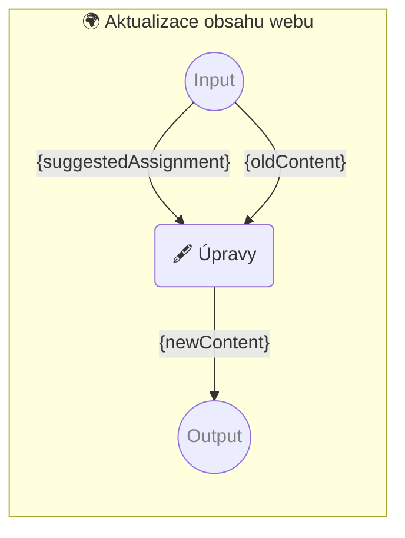

# 🌍 Aktualizace obsahu webu

Instrukce pro úpravu obsahu webové stránky za pomocí [🌠 Prompt template pipelines](https://github.com/webgptorg/promptbook).

-   PROMPTBOOK URL https://webgpt.cz/promptbook/update-website-content-cs.ptbk.md
-   PROMPTBOOK VERSION `0.39.*`
-   INPUT  PARAM `{oldContent}` Původní obsah webu
-   INPUT  PARAM `{suggestedAssignment}` Požadavek od uživatele na změnu
-   OUTPUT PARAM `{newContent}` Nový obsah webu

<!--
## 🖋 Vylepšení zadání

-   MODEL VARIANT Completion
-   MODEL NAME `gpt-3.5-turbo-instruct`
-   POSTPROCESSING `spaceTrim`

```
Jste zkušený webdesignér a manažer, od máte od uživatele nezpracované zadání, co změnit na webových stránkách.
Udělejte si z toho profesionální a strukturované zadání.

## Surové zadání ve znění od zákazníka

{suggestedAssignment}

## Zadání
```

`-> {proffesionalAssignment}` Profesionálně vypadající požadavek na změnu

## 👤 Schválení vylepšeného zadání

-   PROMPT DIALOG

Je to změna, kterou chcete provést?

```
{proffesionalAssignment}
```

`-> {finalAssignment}` Finální žádost o změnu

-->

<!--Graph-->
<!-- ⚠️ WARNING: This section was auto-generated -->



<!--/Graph-->

## 🖋 Úpravy

-   MODEL VARIANT Chat
-   MODEL NAME `gpt-4-1106-preview` <!-- <- TODO: !! The best model for this? -->
-   POSTPROCESSING `spaceTrim`

```
Jste zkušený copywriter a upravujete obsah stránky podle pokynů uživatele.

## Úkol

{suggestedAssignment}

## Původní obsah

{oldContent}

## Nový obsah dle zadání
```

`-> {newContent}`
