# 🗞 Zadání webu

Instrukce pro napsání úvodník do městského časopisu za pomocí [🌠 Prompt template pipelines](https://github.com/webgptorg/promptbook).

-   PROMPTBOOK URL https://webgpt.cz/promptbook/ruka/web.ptbk.md
-   PROMPTBOOK VERSION 0.20.0
-   Input param `{inputText}` Vstupní text
-   Output param `{outputText}` Text emailu

```mermaid
%% 🔮 Tip: Open this on GitHub or in the VSCode website to see the Mermaid graph visually

flowchart LR
  subgraph "🗞 Zadání webu"

      direction TB

      input((Input)):::input
      templateVycisteniVstupu("Vyčištění vstupu")
      input--"{inputText}"-->templateVycisteniVstupu
      templateNazevWebu("Název webu")
      templateVycisteniVstupu--"{inputTextCleaned}"-->templateNazevWebu
      templateDomeny("Domény")
      templateNazevWebu--"{title}"-->templateDomeny
      templateVycisteniVstupu--"{inputTextCleaned}"-->templateDomeny
      templateDomeny("Domény")
      templateDomeny--"{domainsCommaSeparated}"-->templateDomeny
      templateZadani("Zadání")
      templateNazevWebu--"{title}"-->templateZadani
      templateVycisteniVstupu--"{inputTextCleaned}"-->templateZadani
      templateEmail("Email")
      templateNazevWebu--"{title}"-->templateEmail
      templateZadani--"{assignment}"-->templateEmail
      templateDomeny--"{domains}"-->templateEmail

      templateEmail--"{outputText}"-->output
      output((Output)):::output

      classDef input color: grey;
      classDef output color: grey;

  end;
```

<!--Graph-->
<!-- ⚠️ WARNING: This section was auto-generated -->



<!--/Graph-->

## Vyčištění vstupu

-   MODEL VARIANT Chat
-   MODEL NAME `gpt-4-1106-preview`
-   POSTPROCESS `spaceTrim`

```
Vyčisti email pro další zpracování

## Pravidla

- Tvým úkolem je vyčistit text emailu
- Napiš pouze vyčištěný text, nic jiného
- Odstraň zbytečné informace typu podpis, citace, zdvořilostní fráze, atd.

## Text emailu

> {inputText}

```

-> `{inputTextCleaned}`

## Název webu

-   MODEL VARIANT Chat
-   MODEL NAME `gpt-4-1106-preview`
-   POSTPROCESS `spaceTrim`
-   EXPECT MAX 3 WORDS
-   EXPECT MAX 1 LINE
-   EXPECTED MAX 30 CHARACTERS

```
Jsi zkušený copywrighter a dostal jsi zakázku na vytvoření názvu pro nový web. Zákazník ti poslal zadání.

## Pravidla

- Tvým úkolem vymyslet jednoduchý a výsti쬹칳 název pro web
- Napiš pouze jeden název, nic jiného
- Vymýšlej název, ne doménu

## Zadání

> {inputTextCleaned}

```

-> `{title}`

## Domény

-   MODEL VARIANT Chat
-   MODEL NAME `gpt-4-1106-preview`
-   POSTPROCESS `spaceTrim`
-   EXPECT MAX 1 LINE

```
Jsi zkušený copywrighter a webový designer  jsi dostal zakázku na vytvoření seznamu nejvhodnějších domén pro webovou stránku "{title}"

## Pravidla

- Tvým úkolem vymyslet seznam nejvhodnějších domén web "{title}"
- Napiš pouze jeden domény oddělené čárkou, nic jiného
- Neber do úvahy, zda je doména volná nebo ne, to bude zkontrolováno při dalším kroku

## Zadání webu

Tak to vypadá zadání webu, 콎i캞 se primárně názvem webu "{title}", avšak do úvahy m콢쬰코 vzít i další prvky ze zadání od zákazníka:

> {inputTextCleaned}

```

-> `{domainsCommaSeparated}`

## Domény

-   EXECUTE SCRIPT

```javascript
domainsCommaSeparated.split(',').join('\n');
```

-> `{domains}`

## Zadání

-   MODEL VARIANT Chat
-   MODEL NAME `gpt-4-1106-preview`
-   POSTPROCESS `spaceTrim`
-   EXPECT MIN 10 WORDS
-   EXPECT MIN 3 LINES

```
Jsi zkušený webový vývojář a dostal jsi zakázku na vytvoření nového webu "{title}". Zákazník ti poslal email.

## Pravidla

- Tvým úkolem je z emailu vytvořit zadání pro nový web
- Napiš pouze zadání pro web
- Zadání je strukturované a obsahuje všechny potřebné informace
- Zadání obsahuje 캜칤slovaný seznam všech po쬬davk콢


## Text emailu

> {inputTextCleaned}

```

-> `{assignment}`

## Email

<!-- TODO: [🧩] DRY via extending or imports -->

-   SIMPLE TEMPLATE

```
Dobrý den,

na Vaše zadání jsme se podívali a připravili ho pro našeho vývojáře.
Zde je zadání pro váš nový web **"{title}"**:

> {assignment}


Nejvhodnější domény pro web **"{title}"** jsou:

- {domains}


*PS: Jedná se o automaticky vygenerovanou odpověď, kterou si je potřeba překontrolovat.*

S pozdravem,
R.U.K.A.
```

`-> {outputText}`
